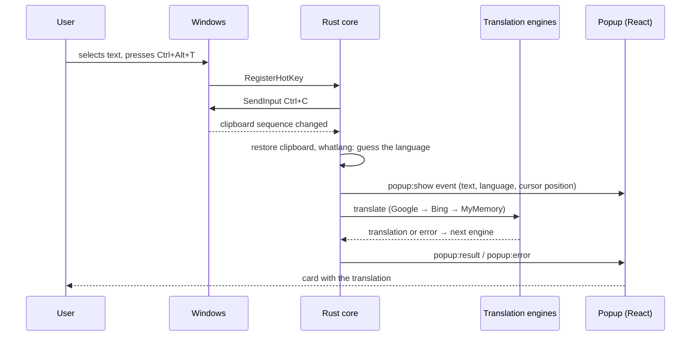

[Русский](README.md) | English

<div align="center">


# UTranslate

Translate selected text with a hotkey — a capsule pops up next to your cursor, no keys or accounts.

[](https://github.com/ninezeroshine/UTranslate/releases/latest)
[](https://github.com/ninezeroshine/UTranslate/releases)
[](https://github.com/ninezeroshine/UTranslate/actions/workflows/ci.yml)

[](LICENSE)


**[Download the latest release](https://github.com/ninezeroshine/UTranslate/releases/latest)**

</div>

## What it is

Select text in an app that supports `Ctrl+C`/`Ctrl+V`, press `Ctrl+Alt+T` — a capsule with the translation pops up next to your cursor. A second hotkey replaces the selected text with its translation right in the input field. The default engines are free, no keys or sign-up. Nothing leaves your machine except the text itself, which goes to whichever translation engine you picked.

<table>
<tr><th>Light theme</th><th>Dark theme</th></tr>
<tr>
<td></td>
<td></td>
</tr>
</table>

<div align="center">

</div>

## Features

- **Popup next to the cursor in apps that support `Ctrl+C`/`Ctrl+V`** — browser, chat app, editor, terminal: selection is captured by emulating the key presses, the way QTranslate did it.
- **In-place replacement** — a second hotkey translates and pastes into the same field only if the original window and selection are still active; a changed context cancels the operation. Supported clipboard formats are preserved, and ambiguous captures are cancelled without discarding the original contents. A toast confirms "Replaced: …" after the paste.
- **Three engines with no keys** — Google → Bing → MyMemory, automatic fallback to the next one on failure with a badge showing why.
- **Language autodetect and swap** — if the selected text is already in your primary language, it translates to the secondary one, no manual switching needed.
- **Dictionary mode** — for one or two words, the popup shows alternative meanings by part of speech instead of a phrase translation.
- **History with search, and favorites** — every translation is saved to a local SQLite database, searchable by substring, favorites export to CSV.
- **Pinning** — the popup stays on screen until closed explicitly and refreshes on the next hotkey press.
- **System, dark, or light theme** — switchable in settings, the popup and main window follow the choice without a restart.
- **Autostart with Windows** and tray-only operation with no window on screen.
- **Auto-update** — a signed installer, checked 15 seconds after launch and every 6 hours, with an "Update to X" item in the tray menu.
- **No telemetry** — the only network calls go to the chosen translation engine and to GitHub Releases for updates.

## Screenshots

<table>
<tr><th>Translate (light)</th><th>Translate (dark)</th></tr>
<tr>
<td></td>
<td></td>
</tr>
<tr><th>History (dark)</th><th>Favorites (light)</th></tr>
<tr>
<td></td>
<td></td>
</tr>
<tr><th colspan="2">Settings (dark)</th></tr>
<tr><td colspan="2"></td></tr>
</table>

## Installation

1. Download the installer from the [Releases](https://github.com/ninezeroshine/UTranslate/releases/latest) page and run it.
2. Windows SmartScreen will warn about an unrecognized publisher — the installer is signed with the update key, not a publisher certificate. Click "More info" → "Run anyway".
3. After installation UTranslate runs from the tray; no window opens on its own.

Default hotkeys:

| Action | Shortcut |
|---|---|
| Translate selection into the popup | `Ctrl+Alt+T` |
| Replace selection with its translation | `Ctrl+Alt+R` |
| Open the main window | `Ctrl+Alt+W` |

Change them under Settings → Hotkeys. A shortcut already used by another program is flagged the moment you try to assign it.

Updates itself: checks 15 seconds after launch and every 6 hours; when it finds one, an "Update to X.Y.Z" item appears in the tray menu and in the About section.

## How to use it

**Translate a selection.** Select text in an app that supports `Ctrl+C`/`Ctrl+V` → `Ctrl+Alt+T` → the pill next to your cursor unfolds into a card with the translation. `Esc`, a click outside, or losing focus closes the popup.

In the card, click **“Replace”** to put the displayed translation into the original selection without translating again or pressing another hotkey. Replacement only runs while the original window, field, and selection are still available; otherwise it is cancelled.

**Replace text in a field.** Select text → `Ctrl+Alt+R` → the selection is replaced with the translation if the window and selection do not change while the request is pending. A changed context cancels the paste. Supported clipboard formats are preserved, and ambiguous captures are cancelled without discarding the original contents; a "Replaced: …" capsule appears next to the cursor for 2 seconds.

<div align="center">

</div>

**Open the window and translate manually.** `Ctrl+Alt+W` opens the main window with Translate, History, Favorites, and Settings tabs; if you had a selection, it's dropped into the source field.

For one or two words, the popup switches to dictionary mode and shows alternative meanings instead of a phrase translation. The pin icon in the popup header keeps it on screen — it stays open and refreshes on the next hotkey press until closed explicitly.

## How it works



| File | What it does |
|---|---|
| `app/src-tauri/src/lib.rs` | commands, hotkeys, tray, updater, the "capture → translate → popup" flow |
| `app/src-tauri/src/capture.rs` | emulates `Ctrl+C` / `Ctrl+V` and restores supported clipboard formats |
| `app/src-tauri/src/engines.rs` | Google, Bing, MyMemory, the fallback chain and cache |
| `app/src-tauri/src/db.rs` | history and favorites, SQLite |
| `app/src-tauri/src/popup.rs` | the popup window: position at the cursor, size to fit content |
| `app/src/popup/Popup.tsx` | the capsule: pill → card, all popup states |
| `app/src/main/Main.tsx` | main window: Translate, History, Favorites, Settings |
| `app/src/ui/` | shared UI components |

Stack: Tauri 2 (Rust) + React 19 + TypeScript + Tailwind CSS v4 + Motion.

Privacy: the text goes only to the engine you picked, nowhere else. Everything else is local, under `%APPDATA%\com.utranslate.app\` (`settings.json` and `utranslate.db`) — no telemetry, no analytics.

## Building from source

Requires: Windows 10/11, [Node 22](https://nodejs.org), pnpm 10, Rust stable (MSVC), WebView2 Runtime (already installed on Windows 11).

```bash
cd app
pnpm install
pnpm tauri dev          # dev mode, Vite runs on 127.0.0.1:1420
```

Vite listens on IPv4 only (`127.0.0.1`) — on `localhost` the Tauri CLI can wait up to 180 seconds for the port.

```bash
cd app/src-tauri && cargo test              # core unit tests
cd app && pnpm exec tsc --noEmit            # type check
cd app && pnpm test:frontend                # request-order and favorites tests
cd app && pnpm test:popup                   # Playwright popup geometry tests
cd app && pnpm build                         # production frontend build
cd app && pnpm tauri build                  # NSIS installer
```

Release:

```bash
pnpm release 0.2.0
```

The script bumps the version in `package.json`, `src-tauri/tauri.conf.json`, and `Cargo.toml`, commits, tags, and pushes. GitHub Actions (`.github/workflows/release.yml`) then builds the installer via `tauri-action`, signs it with the key from the `TAURI_SIGNING_PRIVATE_KEY` secret, and publishes the release along with `latest.json` for auto-update.

## Roadmap

- **Screen-area OCR** (`Ctrl+Alt+S`): a selection overlay → `Windows.Media.Ocr` → the same popup.
- **LLM actions in the popup**: explain, rephrase, fix, change tone — via Gemini or another keyed provider.
- **DeepL and Gemini as translation engines**, alongside the three free ones.
- **English UI**.

## Contributing

Issues and PRs are welcome. Commits can be in Russian.

UI design sources (the "Capsule" direction) live in [`design/`](design/).

## License

[MIT](LICENSE) © 2026 ninezeroshine
