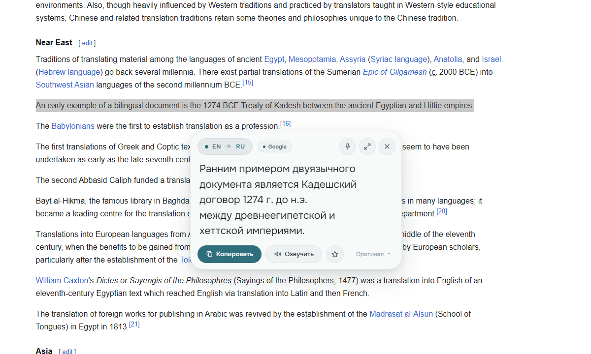
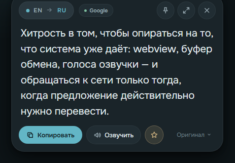
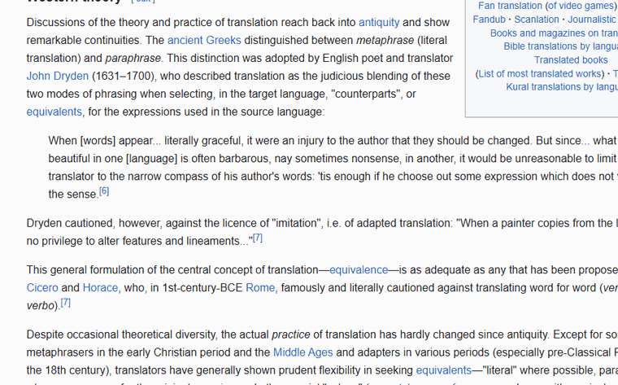
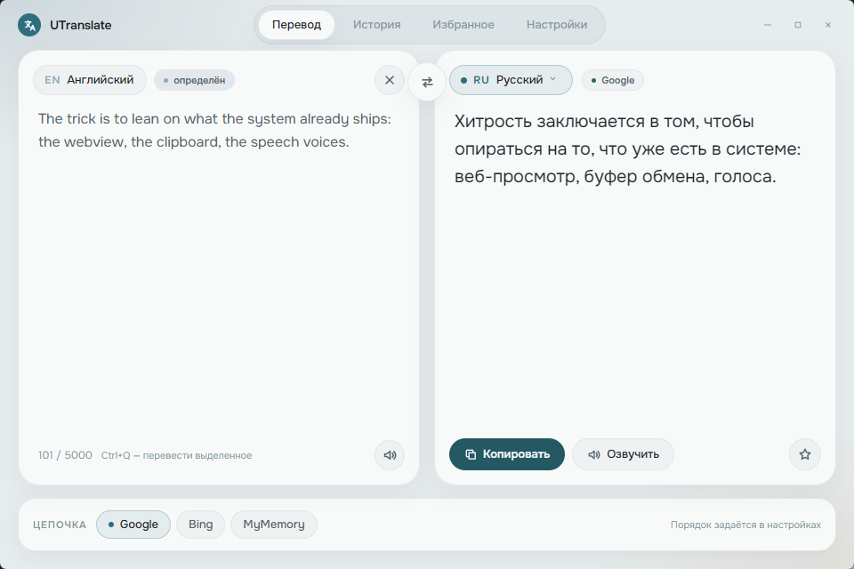
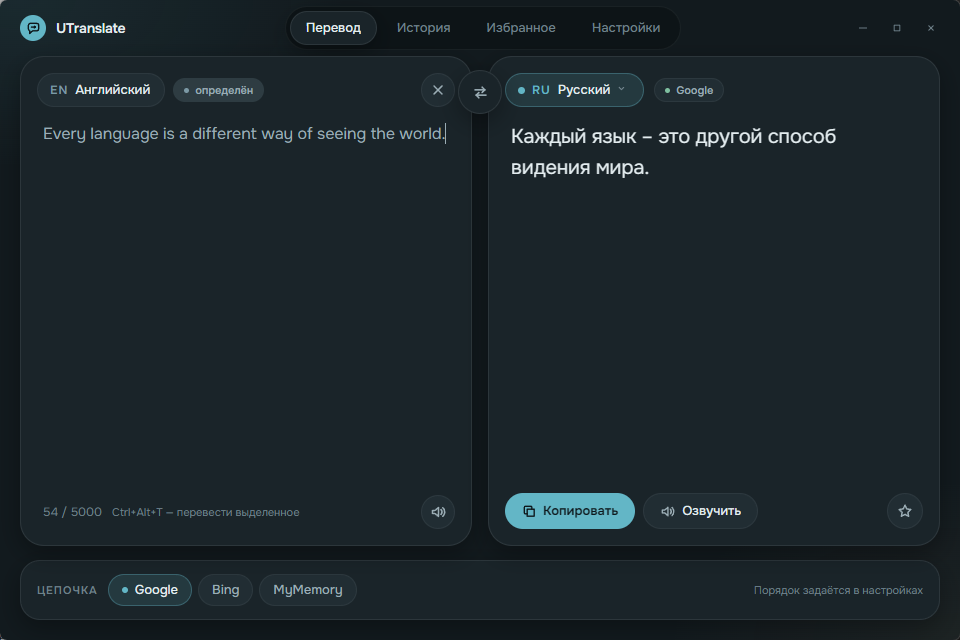
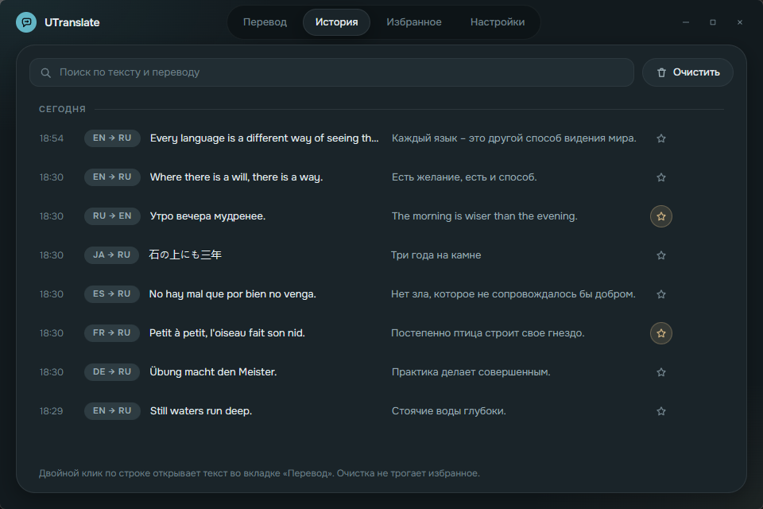
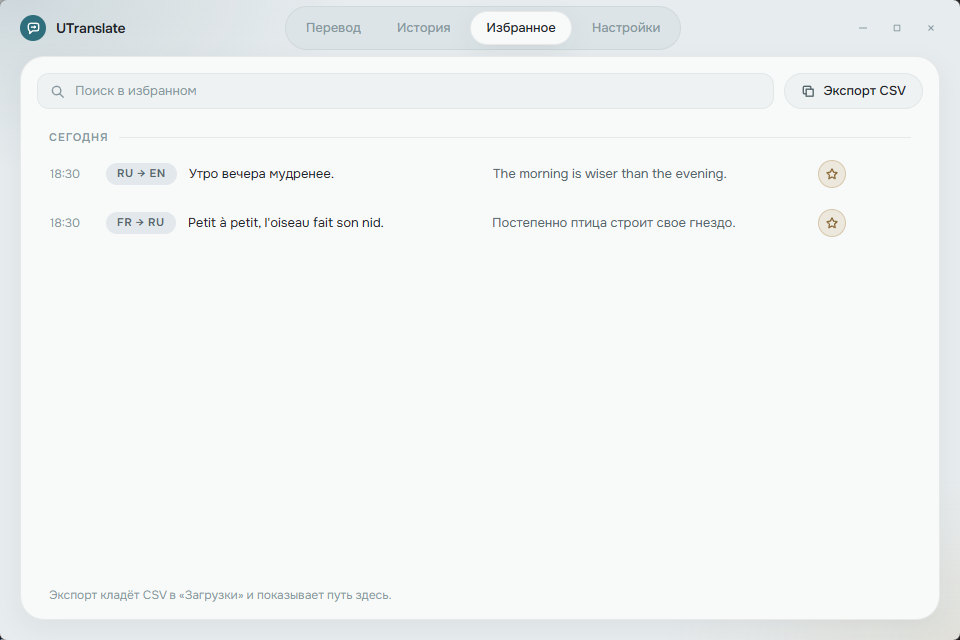
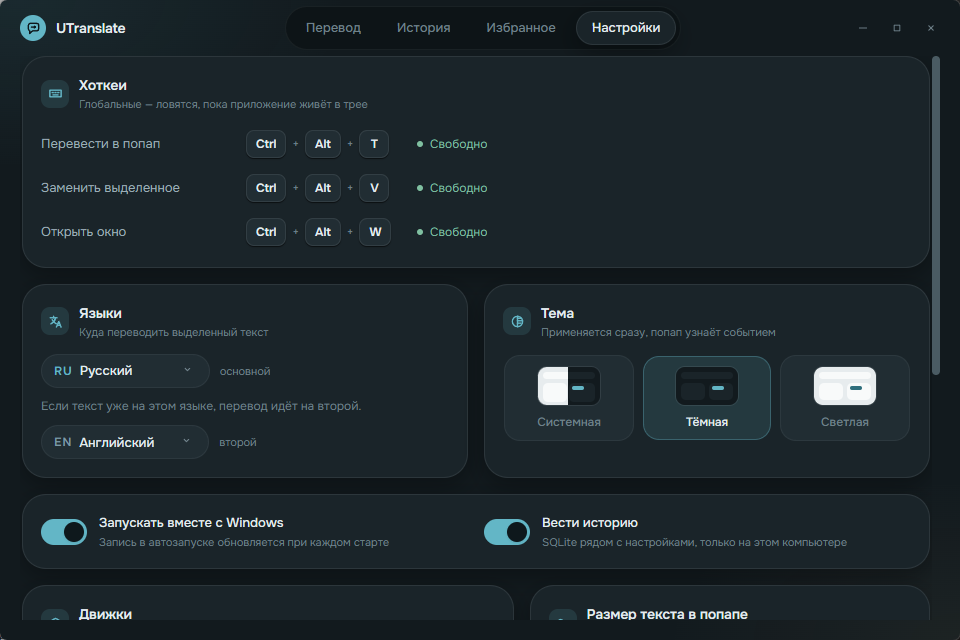
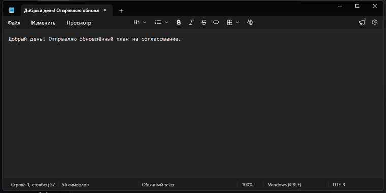
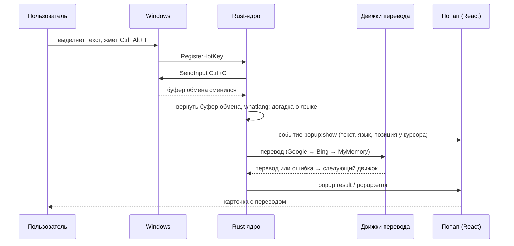

Русский | [English](README.en.md)

<div align="center">


# UTranslate

Перевод выделенного текста по хоткею — капсула у курсора, без ключей и аккаунтов.

[](https://github.com/ninezeroshine/UTranslate/releases/latest)
[](https://github.com/ninezeroshine/UTranslate/releases)
[](https://github.com/ninezeroshine/UTranslate/actions/workflows/ci.yml)

[](LICENSE)


**[Скачать последнюю версию](https://github.com/ninezeroshine/UTranslate/releases/latest)**

</div>

## Что это

Выделил текст в приложении с поддержкой `Ctrl+C`/`Ctrl+V`, нажал `Ctrl+Alt+T` — рядом с курсором всплывает капсула с переводом. Второй хоткей заменяет выделенное переводом прямо в поле ввода. Движки по умолчанию бесплатные, без ключей и регистрации. Данные не покидают компьютер, кроме самого текста, который уходит в выбранный движок перевода.

<table>
<tr><th>Светлая тема</th><th>Тёмная тема</th></tr>
<tr>
<td></td>
<td></td>
</tr>
</table>

<div align="center">

</div>

## Возможности

- **Перевод области экрана** — `Ctrl+Alt+S` открывает нативный селектор; русский и английский текст распознаются локально, затем в движок перевода отправляется только текст. Снимок не уходит в сеть и не попадает в буфер обмена.
- **Попап у курсора в приложениях с поддержкой `Ctrl+C`/`Ctrl+V`** — браузер, мессенджер, редактор, терминал: захват выделения через эмуляцию клавиш, как в QTranslate.
- **Замена текста на месте** — второй хоткей переводит и вставляет результат в то же поле, если исходное окно и выделение всё ещё те же; при изменении контекста операция отменяется. Поддерживаемые форматы буфера сохраняются, неоднозначный захват отменяется без потери исходных данных, после вставки показывается тост «Заменено: …».
- **Три движка без ключей** — Google → Bing → MyMemory, при отказе одного автоматический переход на следующий с бейджем причины.
- **Автоопределение языка и swap** — если выделенный текст уже на основном языке, перевод идёт на запасной, вручную переключать не нужно.
- **Словарный режим** — для одного-двух слов вместо перевода-фразы показываются варианты значений по частям речи.
- **История с поиском и избранное** — каждый перевод сохраняется в локальную SQLite, поиск по подстроке, избранное экспортируется в CSV.
- **Закрепление попапа** — капсула остаётся на экране до явного закрытия и обновляется по следующему хоткею.
- **Тема системная, тёмная или светлая** — переключается в настройках, попап и окно следуют выбору без перезапуска.
- **Автозапуск с Windows** и работа из трея без окна на экране.
- **Автообновление** — подписанный установщик, проверка через 15 секунд после старта и каждые 6 часов, пункт «Обновить до X» в трее.
- **Без телеметрии** — сетевые обращения только к выбранному движку перевода и к GitHub Releases за обновлением.

## Скриншоты

<table>
<tr><th>Перевод (светлая)</th><th>Перевод (тёмная)</th></tr>
<tr>
<td></td>
<td></td>
</tr>
<tr><th>История (тёмная)</th><th>Избранное (светлая)</th></tr>
<tr>
<td></td>
<td></td>
</tr>
<tr><th colspan="2">Настройки (тёмная)</th></tr>
<tr><td colspan="2"></td></tr>
</table>

## Установка

1. Скачайте установщик со страницы [Releases](https://github.com/ninezeroshine/UTranslate/releases/latest) и запустите.
2. Windows SmartScreen предупредит про неизвестного издателя — установщик подписан ключом обновлений, но не сертификатом издателя. Нажмите «Подробнее» → «Выполнить в любом случае».
3. После установки UTranslate работает из трея, окно на экране не открывается.

Хоткеи по умолчанию:

| Действие | Сочетание |
|---|---|
| Перевести выделенное в попап | `Ctrl+Alt+T` |
| Перевести область экрана | `Ctrl+Alt+S` |
| Заменить выделенное переводом | `Ctrl+Alt+R` |
| Открыть окно | `Ctrl+Alt+W` |

Меняются в Настройках → Хоткеи. Сочетание, занятое другой программой, помечается сразу при попытке назначить.

Обновляется само: проверка через 15 секунд после запуска и раз в 6 часов, при находке — пункт «Обновить до X.Y.Z» в меню трея и в разделе «О программе».

## Как пользоваться

**Перевести выделенное.** Выделите текст в приложении с поддержкой `Ctrl+C`/`Ctrl+V` → `Ctrl+Alt+T` → капсула у курсора разворачивается в карточку с переводом. `Esc`, клик вне окна или потеря фокуса закрывают попап.

В карточке нажмите **«Заменить»**, чтобы подставить уже показанный перевод вместо исходного выделения без повторного перевода и хоткея. Замена выполняется только пока исходное окно, поле и выделение доступны; иначе операция отменяется.

Нажмите **«Редактировать перевод»**, чтобы поправить результат прямо в попапе. **«Готово»** сохраняет изменённый текст в истории, **«Отменить»** или `Esc` отменяют правки; `Enter` вставляет новую строку, `Ctrl+Enter` завершает редактирование. Копирование, озвучивание и замена используют текущий черновик. Значок движка открывает выбор Google, Bing, MyMemory или **«Автоматически»** для текущего исходного текста; выбор действует только для этого перевода.

**Заменить текст в поле.** Выделите текст → `Ctrl+Alt+R` → на месте выделения оказывается перевод, если окно и выделение не менялись во время запроса. При изменении контекста вставка отменяется. Поддерживаемые форматы буфера сохраняются, а неоднозначный захват отменяется без удаления исходного содержимого; у курсора на 2 секунды всплывает капсула «Заменено: …».

<div align="center">

</div>

**Открыть окно и перевести вручную.** `Ctrl+Alt+W` открывает главное окно с вкладками Перевод, История, Избранное, Настройки; если было выделение, оно подставляется в поле источника.

**Перевести текст с экрана.** Нажмите `Ctrl+Alt+S` или **«С экрана»** → обведите текст на любом мониторе → дождитесь локального распознавания и перевода в обычном попапе. `Esc` и правая кнопка мыши отменяют выбор. Ошибки распознавания можно поправить в блоке **«Оригинал»** — при переводе с экрана он редактируемый. Сейчас OCR рассчитан на русский и английский; [архитектура, приватность и ограничения](docs/screen-translation.md).

Для одного-двух слов попап переходит в словарный режим и вместо перевода фразы показывает варианты значений. Значок булавки в шапке попапа закрепляет его на экране — он остаётся открытым и обновляется по следующему хоткею, пока его не закрыть явно.

## Как устроено



| Файл | Что делает |
|---|---|
| `app/src-tauri/src/lib.rs` | команды, хоткеи, трей, апдейтер, поток «захват → перевод → попап» |
| `app/src-tauri/src/capture.rs` | эмуляция `Ctrl+C` / `Ctrl+V` с возвратом поддерживаемых форматов буфера |
| `app/src-tauri/src/engines.rs` | Google, Bing, MyMemory, цепочка с fallback и кэшем |
| `app/src-tauri/src/db.rs` | история и избранное, SQLite |
| `app/src-tauri/src/popup.rs` | окно попапа: позиция у курсора, размер под содержимое |
| `app/src/popup/Popup.tsx` | капсула: пилюля → карточка, все состояния попапа |
| `app/src/main/Main.tsx` | главное окно: Перевод, История, Избранное, Настройки |
| `app/src/ui/` | общие компоненты интерфейса |

Стек: Tauri 2 (Rust) + React 19 + TypeScript + Tailwind CSS v4 + Motion.

Приватность: текст уходит только выбранному движку перевода, больше никуда. Снимки для OCR обрабатываются только в памяти на компьютере. Все данные — локально, в `%APPDATA%\com.utranslate.app\` (`settings.json` и `utranslate.db`), телеметрии и аналитики нет.

## Сборка из исходников

Требуется: Windows 10/11, [Node 22](https://nodejs.org), pnpm 10, Rust stable (MSVC), WebView2 Runtime (в Windows 11 уже установлен).

```bash
cd app
pnpm install
pnpm tauri dev          # dev-режим, Vite поднимается на 127.0.0.1:1420
```

Vite слушает только IPv4 (`127.0.0.1`) — на `localhost` Tauri CLI может ждать порт до 180 секунд.

```bash
cd app/src-tauri && cargo test              # юнит-тесты ядра
cd app && pnpm exec tsc --noEmit            # проверка типов
cd app && pnpm test:frontend                # тесты очередности запросов и избранного
cd app && pnpm test:popup                   # Playwright-тесты геометрии попапа
cd app && pnpm build                         # production frontend build
cd app && pnpm tauri build                  # NSIS-установщик
```

Релиз:

```bash
pnpm release 0.2.0
```

Скрипт проставляет версию в `package.json`, `src-tauri/tauri.conf.json` и `Cargo.toml`, коммитит, ставит тег и пушит. Дальше GitHub Actions (`.github/workflows/release.yml`) собирает установщик через `tauri-action`, подписывает его ключом из секрета `TAURI_SIGNING_PRIVATE_KEY` и публикует релиз с `latest.json` для автообновления.

## План

- **LLM-действия в попапе**: объяснить, перефразировать, исправить, сменить тон — через Gemini или другой провайдер по ключу.
- **DeepL и Gemini по ключу** как движки перевода, помимо трёх бесплатных.
- **Интерфейс на английском**.

## Участие

Issues и PR приветствуются. Коммиты можно оставлять на русском.

Дизайн-исходники интерфейса (направление «Капсула») — в [`design/`](design/).

## Лицензия

[MIT](LICENSE) © 2026 ninezeroshine
